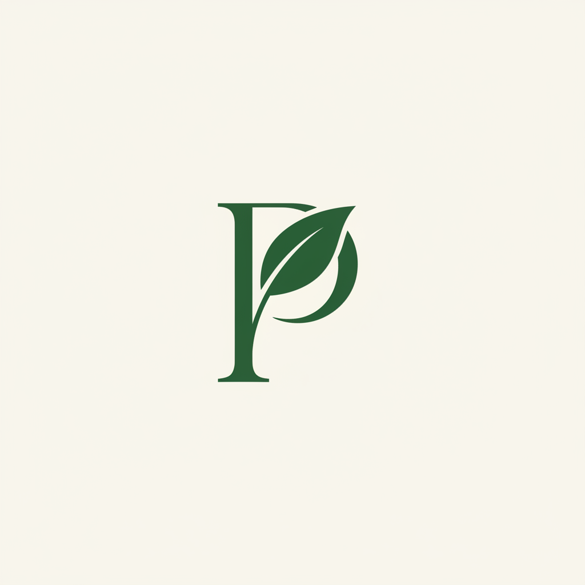

# Pureji Brand Logo & Core Visual Asset Guidelines
**The Safe-Pregnancy Matcha: Triple-Screened & Certified Heavy-Metal-Free**

## 1. The Official Brand Logo

The Pureji logo is our primary visual signature, engineered specifically for the clinical-chic, laboratory-verified prenatal matcha segment. It bridges traditional Japanese tea heritage with modern pharmaceutical precision, providing an immediate visual trust barrier to support our upcoming seed fundraise.

### Design Philosophy & Rationale
- **The Monogram:** A bespoke, geometric fusion of the uppercase letter **P** and a single, stylized tea leaf. This represents the absolute botanical purity of our single-origin *Camellia sinensis* source material while presenting a structured, architectural form.
- **The Style:** By utilizing high-precision vectors, perfect circular geometry, and uniform stroke weights, the logo rejects the rustic, imperfect, and hand-drawn aesthetics of traditional lifestyle tea brands. It positions Pureji alongside ultra-premium clinical skincare and high-end biotechnology brands.
- **The Mood:** The mark is designed to convey absolute structure, safety, and reassurance to pregnant and nursing millennial mothers. It serves as a visual trust barrier that communicates clinical safety and premium quality.

---

## 2. Official Brand Color Palette

The color system is constrained to a narrow, high-contrast palette. This ensures perfect, consistent reproduction across digital screens and physical packaging substrates using physical Pantone spot inks.

| Color Role | Color Name | Hex Code | Pantone Code | Core Application |
| :--- | :--- | :--- | :--- | :--- |
| **Primary Base** | Deep Forest Green | `#1E3020` | Pantone 553C | Wordmarks, primary borders, heavy typography, and primary brand packaging |
| **Primary Active** | Vibrant Matcha Green | `#4C803B` | Pantone 362C | Active chart bars, certification seals, and highlights |
| **Secondary Accent** | Sage Green | `#7A9A82` | Pantone 5625C | Technical labels, sub-headings, and laboratory charts |
| **Packaging Stock** | Soft Warm White | `#FBFBF9` | Pantone Warm Gray 1C | Retail tins, unboxing brochure background, and website cards |
| **Lab Accents** | Pure Charcoal | `#121411` | Pantone Black 6C | Monospace numbers, borders, and laboratory data tables |

---

## 3. Typographic Hierarchy

Typography is utilized as a structural element to reinforce the scientific authority of our raw laboratory data while maintaining the elegant gravity of a luxury brand.

| Tier | Typeface | Style / Weight | Core Application | Brand Personality |
| :--- | :--- | :--- | :--- | :--- |
| **Primary Header** | *Cormorant Garamond* | Bold or Medium Serif | Primary headers, wordmarks, and packaging titles | Elegant, literary, and authoritative; conveys luxury heritage |
| **Secondary Body** | *Inter* | Regular or Semi-Bold Sans-Serif | Body paragraphs, instructions, and interface text | Clean, modern, highly legible, and fast-rendering |
| **Technical Data** | *JetBrains Mono* | Regular Monospace | Batch-to-Tin (BTSN) codes, ICP-MS parts-per-billion metrics, and tables | Surgical, scientific, transparent, and precise |

---

## 4. Scale, Spacing, and Logo Application Rules

To prevent brand dilution, designers, developers, and manufacturers must strictly observe the following scale, spacing, and application constraints:

### Spacing Requirements
- **Clear Space Zone:** The logo monogram must always be surrounded by a minimum clear space zone equal to **0.5x the height of the central monogram**. No text, graphic patterns, packaging seams, or labels may cross this boundary.

### Scale Constraints
- **Physical Packaging (30g Tin):** The central leaf-monogram must be printed at a minimum height of **14mm** to preserve the delicate geometric stem lines on our physical tins.
- **Digital Platforms (Web and Mobile):** The SVG monogram must remain at or above **48px x 48px** to guarantee sharp display rendering on modern mobile displays.

### Packaging Substrate Guidelines
- **Retail Tin Label:** Print exclusively on **100lb Soft-Touch Matte Paper Stock**. Avoid high-gloss synthetics. Use a spot-gloss UV layer directly over the Batch-to-Tin Serial Number (BTSN) and the base QR code to focus consumer attention on our verification features.
- **Unboxing Brochure:** Print on **100lb Premium Matte Cover Stock** with a natural warm-white uncoated texture. Use spot Pantone inks to avoid muddy halftone registration.

---

## 5. Strategic Sourcing and Advisory Council Outbound Integration

As directed by the founder, our immediate tactical focus is the direct outbound recruitment of our first 5 Maternal Advisory Council (MAC) members. Our visual identity serves as our primary trust-building tool during this recruitment phase:

1. **Unboxing Kit Visual Authority:** The physical "Clinical Sourcing Kit" dispatched to advisors must immediately establish clinical superiority over lifestyle incumbents (Nekohama, Matchaeologist, and Ippodo). 
2. **Clinical Hardware Presentation:** The kit bundles our matte white 30g tin with a traditional bamboo whisk and a sterile 100ml graduated borosilicate beaker. The visual contrast between organic wood and laboratory glass reinforces our scientific-purity positioning.
3. **The Certified Lab Inlay:** Each unboxing kit includes a high-contrast printed brochure detailing our Wazuka, Kyoto terroir and a hand-signed Eurofins ICP-MS lab report verifying that lead levels fall safely below 50 ppb.

---

## 6. Sourcing & Regulatory Compliance References

* **Heavy Metal Thresholds:** California Proposition 65 Safe Drinking Water and Toxic Enforcement Act, Maximum Allowable Dose Levels (MADL) for Lead (less than 0.5 mcg/day) and Cadmium (less than 4.1 mcg/day).
* **Analytical Testing Standard:** Inductively Coupled Plasma Mass Spectrometry (ICP-MS) following FDA Elemental Analysis Manual (EAM) Method 4.7, executed by ISO/IEC 17025 accredited laboratories.
* **Pristine Terroir Origin:** High-altitude, volcanic-soil micro-lots managed by Obubu Tea Farm and Hori Family Farm in Wazuka, Kyoto (altitudes ranging from 380m to 500m elevation).
